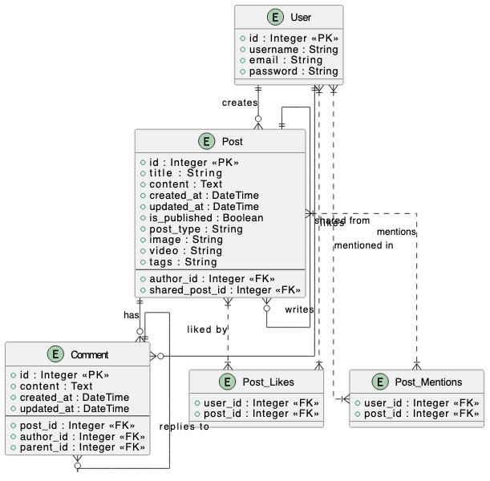

# Social Media App (Django)

## Overview
This is a simple social media web application built with Django. It allows users to register, log in, create posts, view a global feed, and manage their own posts. The app follows best practices for authentication, template inheritance, query optimization, and security.

## Features
### User Management
- **Registration**: Users can register using Django’s built-in user model.
- **Authentication**: Users can log in and log out securely.
- **Password Management (Bonus)**: Users can reset or change their passwords.

### Post Management
- **Global Feed**: Displays posts from all users on the homepage.
- **User Profile Page**: Shows only the logged-in user’s posts with options to edit or delete them.
- **Create Post**: Users can create posts with text and an optional image upload.

### User Interaction & Layout
- **Navigation**: A simple navbar with links to the homepage, profile, login/logout, and registration pages.
- **Footer**: A basic footer with site information.
- **Feedback**: Uses Django’s message framework for notifications (e.g., "Post created successfully").

### Additional Considerations
- **Template Inheritance**: Maintains consistent layouts across all pages.
- **Query Optimization**: Uses `select_related` and `prefetch_related` for efficient database queries.
- **Security**: Protects pages using `LoginRequiredMixin` and `login_required` decorators.

## Setup and Installation
### Prerequisites
- Python 3.x
- Django 4.x
- Pipenv (optional but recommended for dependency management)
- SQLite (default) or PostgreSQL (if preferred)

### Installation Steps
1. **Clone the Repository:**
   ```sh
   git clone https://github.com/Bodrul-Huda/social-media-kia-ora.git
   cd social-media-app
   ```

2. **Create a Virtual Environment:** (Optional but recommended)
   ```sh
   pipenv install --python 3.x
   pipenv shell
   ```

3. **Install Dependencies:**
   ```sh
   pip install -r requirements.txt
   ```

4. **Run Database Migrations:**
   ```sh
   python manage.py migrate
   ```

5. **Create a Superuser (Admin Panel Access):**
   ```sh
   python manage.py createsuperuser
   ```
   Follow the prompts to create an admin user.

6. **Run the Development Server:**
   ```sh
   python manage.py runserver
   ```
   Open your browser and visit `http://127.0.0.1:8000/`

## Sample User Credentials for Testing
You can use the following test credentials:
- **admin:** `admin`
- **Password:** `admin`
- **Username1:** `bodrul`
- **Password:** `123`
- **Username:** `testuser`
- **Password:** `testpassword123`

Alternatively, create a new user from the registration page.

## Usage
1. Register a new account or log in using the provided credentials.
2. Create new posts from the homepage.
3. View all posts in the global feed.
4. Navigate to your profile to edit or delete your posts.
5. Log out when finished.

## Future Enhancements
- Add user profile picture.
- Implement react and comments modification.
- Improve UI with Bootstrap or TailwindCSS.
- Add real-time updates using WebSockets.


## Entity Relationship Diagram (ERD)

-The diagram below represents the database structure of this project.



## License
This project is open-source under the MIT License.

---
Feel free to contribute or suggest improvements!

